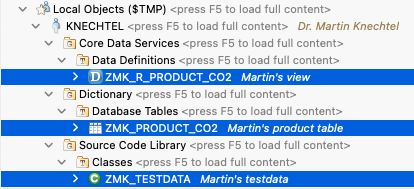
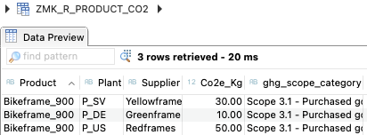
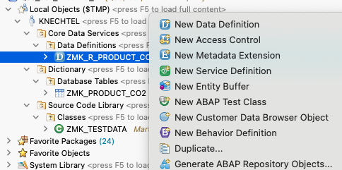
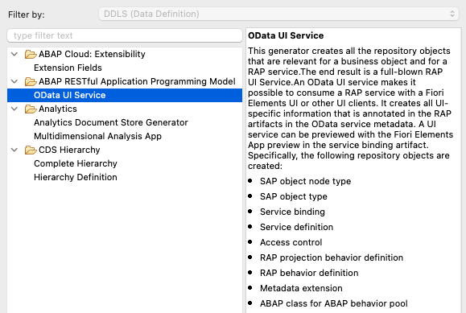
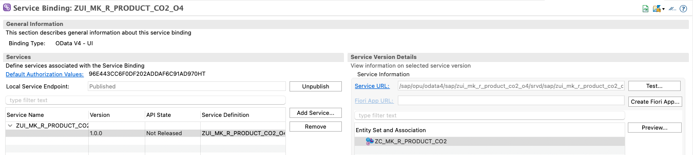
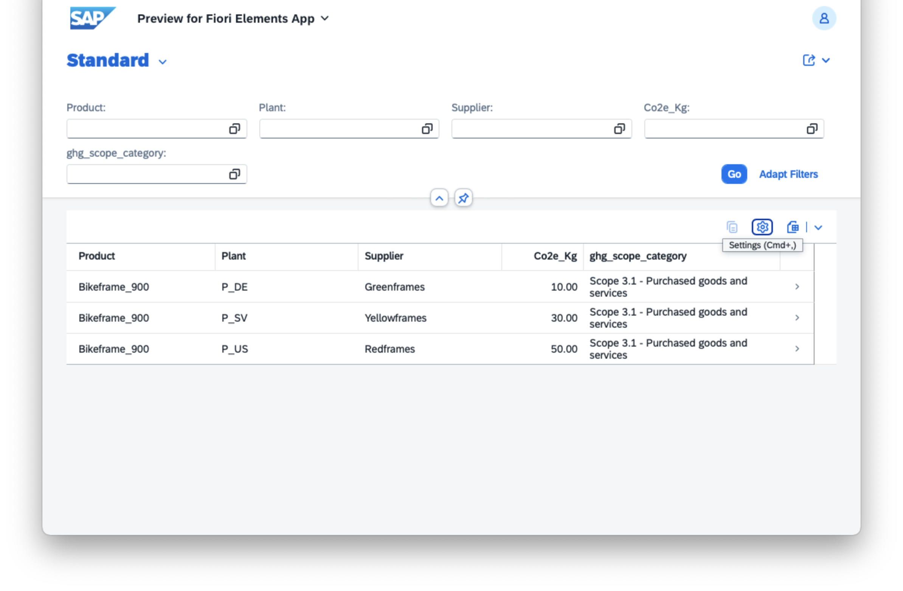

# ABAP_CO2e_products_webshop
Minimal Web shop example with CO2e footprints attached to products.

For a complete example with CO2e category breakdown and if you have your own S/4HANA system at hand, please read my blog [Key User Extensibility and Developer Extensibility for Carbon Footprint Category Breakdown](https://community.sap.com/t5/enterprise-resource-planning-blog-posts-by-sap/key-user-extensibility-and-developer-extensibility-for-carbon-footprint/ba-p/13796046).

If you are looking for a minimalistic example that runs on [free trial for SAP Business Technology Platform, ABAP Environment](https://www.sap.com/products/technology-platform/trial.html) and you want to build up basic ABAP skills, this repo is for you.

1. Create an ABAP Cloud project, learn how to do that in [Learning Journey "Acquiring Core ABAP Skills"](https://learning.sap.com/learning-journeys/acquire-core-abap-skills/preparing-the-development-environment_bc84941b-b4e6-4a6a-9b71-bb5b80e4a4ce)

2. (optional) Generate your artefacts with a Joule prompt, e.g. similar to this one or jump to 3. and create the artifacts by hand.
```
Given the CSV below with sample data, please generate a table, a CDS view on top and generate a program with INSERT statements to fill it with my sample data.

Product;Plant;Supplier;CO2e_kg;GHG_Scope_Category
Bikeframe_900;P_US;Redframes;50;Scope 3.1 - Purchased goods and services
Bikeframe_900;P_DE;Greenframes;10;Scope 3.1 - Purchased goods and services
Bikeframe_900;P_SV;Yellowframes;30;Scope 3.1 - Purchased goods and services
```
3. Create table, the columns may have German names ;-) e.g.
```
define table zmk_product_co2 {

  key produkt        : abap.char(20) not null;
  key werk           : abap.char(20) not null;
  key lieferant      : abap.char(20) not null;
  co2e_kg            : abap.dec(10,2);
  ghg_scope_category : abap.char(40);
}
```
4. Create Data Definition, i.e. a CDS view. Here for simplicity it is a complete projection and we abstract from the underlying column names, e.g.
```
define view entity ZMK_R_PRODUCT_CO2 as select from zmk_product_co2
{
    key produkt as Product,
    key werk as Plant,
    key lieferant as Supplier,
    co2e_kg as Co2e_Kg,
    ghg_scope_category as ghg_scope_category
}
```
5. Fill test data with a small class e.g.
```abab
CLASS zmk_testdata DEFINITION
  PUBLIC FINAL
  CREATE PUBLIC.

  PUBLIC SECTION.
    INTERFACES if_oo_adt_classrun.
ENDCLASS.


CLASS zmk_testdata IMPLEMENTATION.
  METHOD if_oo_adt_classrun~main.
    DATA ls_data TYPE zmk_r_product_co2.

    CLEAR ls_data.
    ls_data-product            = 'Bikeframe_900'.
    ls_data-plant              = 'P_US'.
    ls_data-supplier           = 'Redframes'.
    ls_data-Co2e_Kg            = '50'.
    ls_data-ghg_scope_category = 'Scope 3.1 - Purchased goods and services'.
    INSERT INTO zmk_product_co2 VALUES @ls_data.

    CLEAR ls_data.
    ls_data-product            = 'Bikeframe_900'.
    ls_data-plant              = 'P_DE'.
    ls_data-supplier           = 'Greenframes'.
    ls_data-CO2e_kg            = '10'.
    ls_data-GHG_Scope_Category = 'Scope 3.1 - Purchased goods and services'.
    INSERT INTO zmk_product_co2 VALUES @ls_data.

    CLEAR ls_data.
    ls_data-product            = 'Bikeframe_900'.
    ls_data-plant              = 'P_SV'.
    ls_data-supplier           = 'Yellowframes'.
    ls_data-CO2e_kg            = '30'.
    ls_data-GHG_Scope_Category = 'Scope 3.1 - Purchased goods and services'.
    INSERT INTO zmk_product_co2 VALUES @ls_data.

    out->write( 'success' ).
  ENDMETHOD.
ENDCLASS.
```
6. Check result. You should now have created the following objects and your CDS view should contain the following entries in Data Preview.




7. Generate a small Webshop on top. Right-click your CDS view > "Generate ABAP Repository Objects" > "OData UI service". 




A service binding will be generated. Click "Publish" and "Preview".



Your fresh new Web shop will open in your browser :-)


